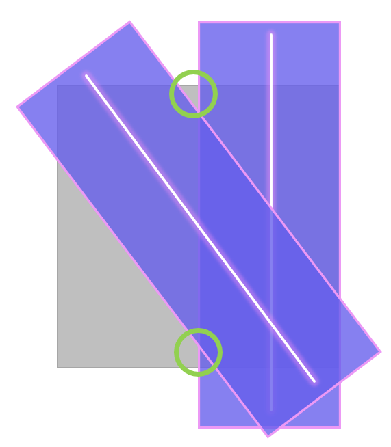

# 永久幽界中央终端

## 进场 ~ BOSS 1

没什么特别需要注意的。

### BOSS 1 某个医师长的记忆

BOSS会释放定点击退和黄圈AOE攻击，之后会读条==知觉扰乱药==在场上生成干扰的特效，实际技能范围及生效顺序不会变，冷静记忆应对即可。最后一次击退和黄圈会同时出现，如果实在记不得，可以在黄圈安全区内使用防击退技能回避击退，唯独注意不要吃到多重黄圈又被击退到场边。

对<Role name="tank" />T死刑后会有<Status :id="2104" name="中毒" dispel/>，<Role name="healer" />可以康复驱散。

## BOSS 1 ~ BOSS 2

没什么特别需要注意的。

### BOSS 2 某个处刑人的记忆

共有4只，开场会对每名玩家连线，被连线后获得对应buff，只能攻击连线自己的BOSS，稍后会被拉入各自BOSS的圆环范围内。如果单挑期间玩家被击倒，复活后过几秒会被重新拉回去。

共通机制包括：
* ==斩足刃==：场边交替出现4组刀片，造成直线AOE。
* ==断罪的雷剑==：场边交替出现4组雷线，缓慢向对面移动，移动过半后出现钢铁/月环。
* ==断罪的铁球==：出现3个落点提示后立刻出现铁球，<Role name="tank" /><Role name="healer" /><Role name="dps" />所有人尽快移动到相邻铁球中间贴边，躲避时间很短，尽快移动。
* 读条==连续执行==后，会连续出现斩足刃、铁球、斩足刃、钢铁/月环，实在躲不开注意开自保、回血技能，尽量少吃伤害。

其中各职能还有自己的独立机制：
- <Role name="tank" />：==破碎弹== ：使用<Action name="插言" />打断；==强连击==：死刑，多开点减伤，治疗可能无瑕顾及。
- <Role name="healer" />：==死刑宣告== ：使用 <Action name="康复" />驱散自己身上的<Status :id="4558" name="死亡宣告" dispel/>。
- <Role name="dps" />：场地外侧生成**焦热刑具**，需要躲避场地机制同时尽快击杀该物体，否则身上的<Status :id="4503" name="火伤" />会造成持续伤害，一定时间后火力加强，极易致死。

击杀完自己BOSS的人可以打其他人的BOSS，近战注意在别人圈内也会吃到伤害，远程可以直接在圈外输出。

## BOSS 2 ~ BOSS 3

最后一波有2个士兵会读条释放黄圈，晕眩或沉默都可以打断方便输出

### BOSS 3 某些人的记忆

;;;.guide .cols2
;;;.guide .col

紫色为AOE范围，绿圈为可参考位置。
;;;

;;;.guide .col .grow

场边机兵与场中小人连线时，连线位置会有很宽的直线AOE，找无线位置躲避。第一组直线判定后，立刻移动到上一组直线交叉处躲避第二组直线。

BOSS召唤出多组小人时，人多的地方AOE大，<Role name="tank" /><Role name="healer" /><Role name="dps" />所有人找单人附近躲避。

BOSS缓慢抬手，屏幕上出现 ++某些人的记忆正在蓄力++ 时，BOSS对举起手所对应的半场造成范围攻击。

场地出现多组小人，且场中出现蓝圈时，蓝圈内会造成极高伤害，不可站人，同时蓝圈带有击退效果，注意方向，要被击退到单人附近。

召唤2组逃跑的小人时，会根据小人逃跑的方向生成2条非常宽的直线AOE。2条线一条平行于场边，另一条为斜线。直线AOE大约半场宽，紧贴平行线两头的区域都安全（其中一侧安全区较小，尽可能贴场边即可）。远程可参考斜线外侧区域躲避。
;;;
;;;

